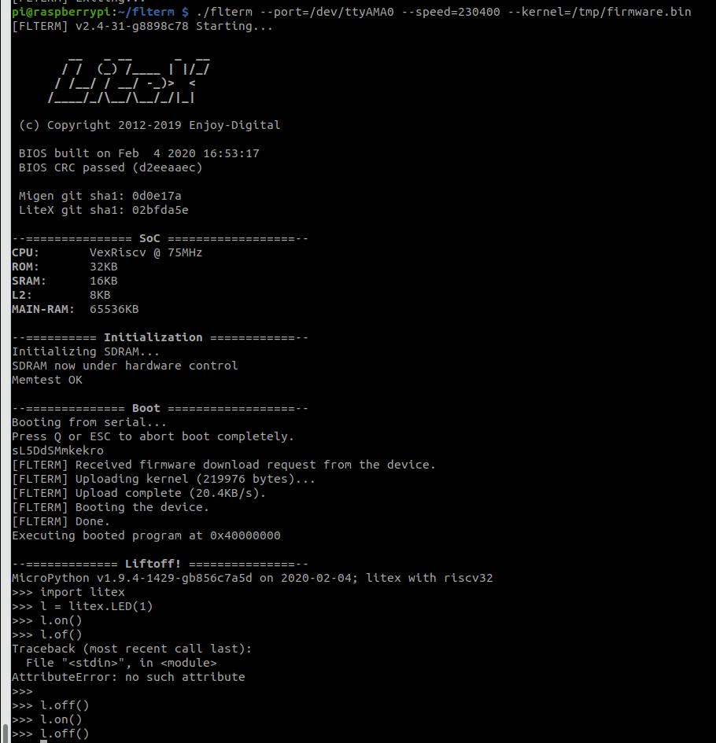

# Create SoC SoftCore on MATRIX Voice FPGA
## 1. Clone Repo & Set up Build Environment

The following steps are for the terminal on your personal computer.

Clone the repo
```bash
git clone https://github.com/matrix-io/litex-buildenv
```

Enter the repo and export all relevant environmental variables
```bash
cd litex-buildenv/
export CPU=vexriscv
export CPU_VARIANT=minimal 
export PLATFORM=matrix_voice
export FIRMWARE=micropython
export TARGET=base
export HDMI2USB_UDEV_IGNORE=somevalue
```

Download the environment dependencies.
```bash
./scripts/download-env.sh
```

Enter the build environment.
```bash
source ./scripts/enter-env.sh
```

## 2. Build Firmware Files

Build the micropython environment, source the Xilinx ISE, and build the FPGA firmware
```bash
./scripts/build-micropython.sh 
source /opt/Xilinx/14.7/ISE_DS/settings64.sh
make gateware && make firmware && make image
```

The process above should result in 2 key files:
- FPGA firmware: `/build/matrix_voice_base_lm32.minimal/gateware/top.bit`
- BIOS+micropython firmware: `/build/matrix_voice_base_lm32.minimal/software/micropython/firmware.bin`

## 3. Set Up Raspberry Pi

Attach the MATRIX Voice to your Raspberry Pi and install the initialization packages.

Add the MATRIX repository and key.
```bash
curl https://apt.matrix.one/doc/apt-key.gpg | sudo apt-key add -
echo "deb https://apt.matrix.one/raspbian $(lsb_release -sc) main" | sudo tee /etc/apt/sources.list.d/matrixlabs.list
```

Update your repository and packages.
```bash
sudo apt-get update
sudo apt-get upgrade
```

Install MATRIX init package
```bash
sudo apt-get install matrixio-creator-init
```

Reboot your device for device initialization to occur.
```bash
sudo reboot
```

SSH back into your Pi from PC and clone repo for FLTERM
```bash
git clone https://github.com/timvideos/flterm
```

## 4. Flash MATRIX Voice FPGA from Pi

Copy over the LiteX firmware files from your PC to your Pi by entering the following commands in your PC's terminal. Be sure to change `YOUR_PI_IP` to your Pi's IP address.

```bash
scp ./build/matrix_voice_base_lm32.minimal/software/micropython/firmware.bin pi@YOUR_PI_IP:/tmp
scp ./build/matrix_voice_base_lm32.minimal/gateware/top.bit pi@YOUR_PI_IP:/tmp
```

Use `xc3sprog` to flash the FPGA firmware to MATRIX Voice. In Pi's terminal, paste the following.
```bash
sudo xc3sprog -c matrix_voice /tmp/top.bit
```
If the above does not work, try the following instead.
```bash
sudo xc3sprog -c sysfsgpio_voice /tmp/top.bit
```

Next, use FLTERM to flash the BIOS & micropython firmware firmware
```bash
cd flterm
./flterm --port=/dev/ttyAMA0 --speed=230400 --kernel=/tmp/firmware.bin
```
The result should look like the following



The above process has been tested with lm32 MCU as well.
